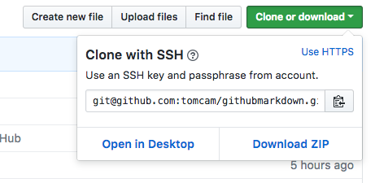
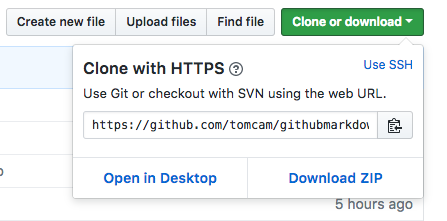
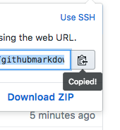

# Clone the repository to your work machine

Now let's make a copy of the repository on your work machine.

## Install Git (and Xcode if you're an Apple developer)

* First, [install Git](https://help.github.com/articles/set-up-git/) if you haven't done so already.

On Macintosh systems, you may be required to download XCode if you haven't already. And before you download XCode, you need to create a free account with the Apple Developer Program.

### If you're a Macintosh developer without Xcode:

* If you're using Mac and haven't join the Apple Developer Program, do so at [https://developer.apple.com/programs/enroll/](https://developer.apple.com/programs/enroll/).

If you come from a traditional Linux, Unix, or Windows background you may be skeptical that just to use 
standard command line tools you must sign up for a special program and download a huge product like Xcode. Sounds crazy,but there's no way around it.

* Next, obtain Xcode at [https://developer.apple.com/xcode/downloads/](https://developer.apple.com/xcode/downloads/).

Do not be distracted by what seems like a requirement to pay
for the account. That's only if you're going to list a product in the App Store.

### Confirm that you have git

* To ensure you have Git, open your terminal and enter `git` at the command line.

The result should be several pages of explanatory text looking something like this:

```
usage: git [--version] [--help] [-C <path>] [-c name=value]
           [--exec-path[=<path>]] [--html-path] [--man-path] [--info-path]
           [-p | --paginate | --no-pager] [--no-replace-objects] [--bare]
           [--git-dir=<path>] [--work-tree=<path>] [--namespace=<name>]
           <command> [<args>]

These are common Git commands used in various situations:

start a working area (see also: git help tutorial)
   clone      Clone a repository into a new directory
```

That shows you Git has been installed. If you see something like this, it means you don't have Git yet:

```
-bash: git: command not found
```

## Create a Git working directory

You need a place to work. Althought it's not necessary for you to think this way, I like to think
of my working directory as only being around for one session. That's because it reminds me that
my work is meant to be kept up to date on GitHub, not my local machine.

Suppose you're doing the documentation for something called MyAwesomeProduct. 

### Move to your home (or Documents) directory

* Go to your home directory (Using bash on Macintosh or Linux):

```
cd ~
```

OR

* Go to your home directory using Windows:

```
cd /d %USERPROFILE%
```

### Create the working directory

* Create a working directory (Using bash on Macintosh or Linux):

```
mkdir  ~/myawesomeproduct
```

OR

* Go to your home directory using Windows:

```
md %USERPROFILE%/myawesomeproduct
```

## Run git clone to make a local copy

You're going to run `git clone` from the terminal. That means a lot of typing to get the address of the repository correct.  GitHub makes it easy to construct the right command line by giving you the full path interactively and pasting it right
to our system's clipboard.

* Find the repository you're interested in, for example, `https://github.com/tomcam/deleteme`, and look for the big green `Clone or download` button on its home page:


There two ways to perform the download: Using `ssh` or using HTTPS. GitHub [recommends the latter](https://help.github.com/articles/which-remote-url-should-i-use/) for many reasons, including proper functioning from behind firewalls.

You'll probably see an option to use SSH:



* Instead, choose `Use HTTPS`:



* Choose the clipboard icon to copy the full path to your system clipboard:



You now have a path on your clipboard in this format:

```
https://github.com/tomcam/deleteme.git
```

* Download the git archive by typing `git clone ` at the terminal, then pasting in the repo's path:

```
git clone https://github.com/tomcam/deleteme.git
Cloning into 'deleteme'...
remote: Counting objects: 4, done.
remote: Compressing objects: 100% (3/3), done.
remote: Total 4 (delta 0), reused 0 (delta 0), pack-reused 0
Unpacking objects: 100% (4/4), done.
```

You may wish to do a directory listing to confirm the repo has been downloaded and expanded into its 
own directory:

```
$ ls
deletme

$ ls deleteme/
LICENSE		README.md
```

## Check that version control is working

Here's something that you'll often do when using Git: run `git status` to see if any files have change. 

* Run `git status` at the command line. 

```bash
git status
```

You'll see a message that everything is up to date:

```
On branch master
Your branch is up-to-date with 'origin/master'.
nothing to commit, working tree clean
```

### Alter a file slightly 

Let's Make a trival change to a file in the project. Normally you might make a backup copy of that file
just to be on the safe side. You don't have to do so in this case. The reason you don't have to 
is that, hey, this is Git. Its whole reason to exist is so that you can return a file to a previous
checked-in state. The other reason is to illustrate `git checkout`, which blows away any changes made in the current 
editing session and gives you the most current checked-in version of the file.

In this example, there are only two files: `LICENSE` and `README.md`. We'll bring up the `README.md` file in a text editor to view its contents. Here's what's in it:

```
# deleteme
hi
```

It's a very, very simple Markdown file. 

* Let's add the word `dude` after the word `hi`:

```
# deleteme
hi dude
```

* Save the file and exit.

The truth is you could have made any changes to the file and it wouldn't matter for this example as you'll see in a moment. But when you're learning something along these lines it's always good to do the simplest possible test of your knowledge before moving on to more complicated tasks.

### Run git status to see what's changed

Now that the `README.md` differs from what's on GitHub, Git should know.

* At the terminal, enter `git status` again:

```bash
git status
```

And you're told there's been a change to this file:

```
On branch master
Your branch is up-to-date with 'origin/master'.
Changes not staged for commit:
  (use "git add <file>..." to update what will be committed)
  (use "git checkout -- <file>..." to discard changes in working directory)

	modified:   README.md

no changes added to commit (use "git add" and/or "git commit -a")
```

### Run git diff to see what changes were made to a file

Imagine you'd changed a number of files and didn't remember what alterations had been made. You'd simply choose one of the files listed as `modified` in the `git status` report and run a `git diff` on it:

```bash
git diff README.md
```

The output shows the line's contents both before and after the change:

```
diff --git a/README.md b/README.md
index 3455f43..76b9240 100644
--- a/README.md
+++ b/README.md
@@ -1,2 +1,2 @@
 # deleteme
-hi
+hi dude
```

## Get rid of the changes with git checkout

One of the best things about Git is that it's pretty much the ultimate undo. If you make changes to 
something and they turn out to cause problems, you can roll back those changes.

In this particular example, we have a super-easy solution to this problem. If we run `git checkout` on the file, git will simply copy back the latest version of that file from your Git archive. Note that because we didn't check in any of our changes, this action cannot be undone.

* Run `git checkout` on the file that was just changed:

```bash
git checkout README.md
```

### See if the checkout succeeded with another git status

Git makes no response after you've done a `git checkout`. That can be a little disconcerting. Let's double-check that the checkout worked.

* Run `git status` to see the state of your repo:

```bash
git status
```

Git acts like nothing ever happened to your repo:

```
On branch master
Your branch is up-to-date with 'origin/master'.
nothing to commit, working tree clean
```


